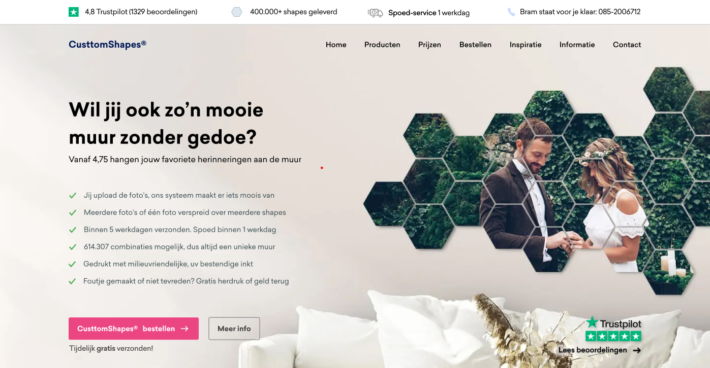
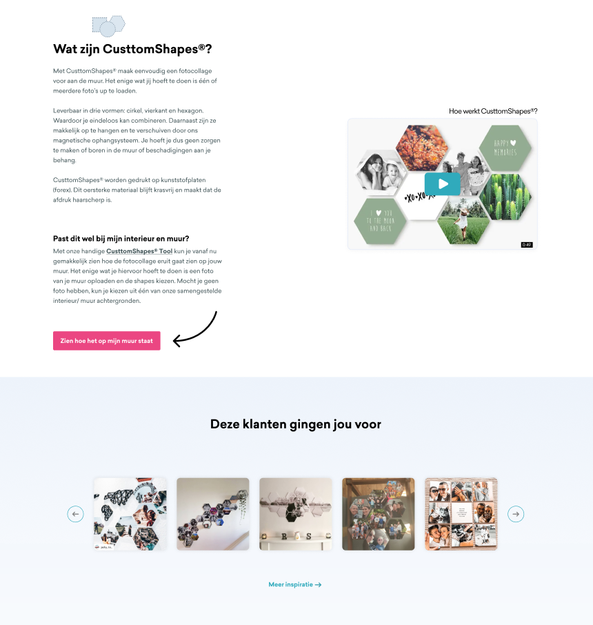
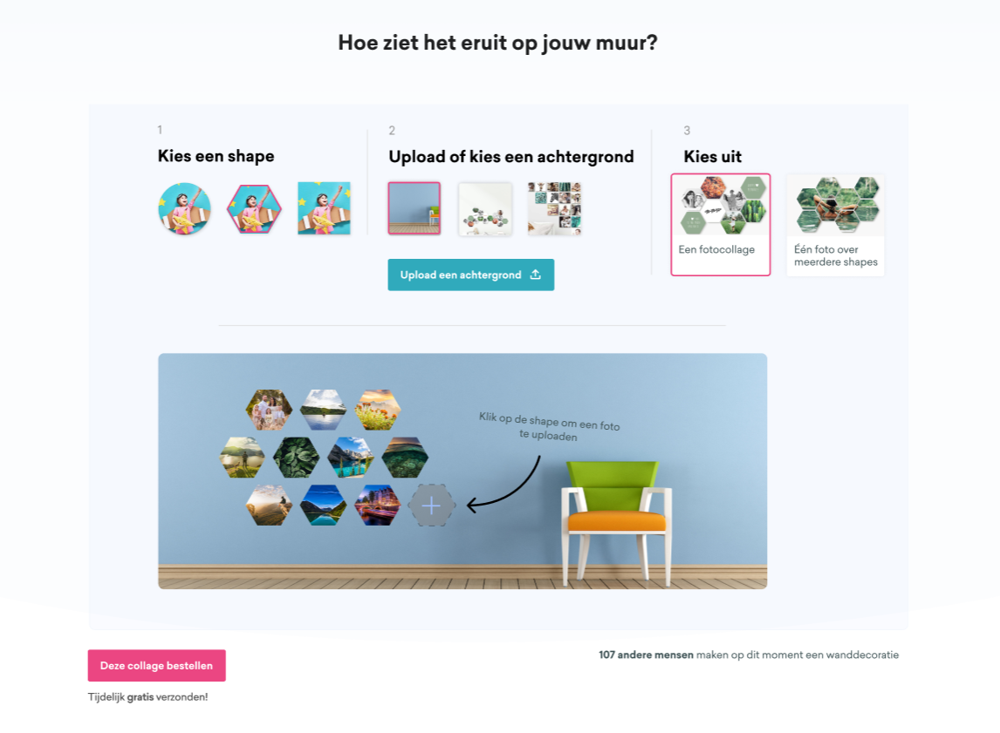
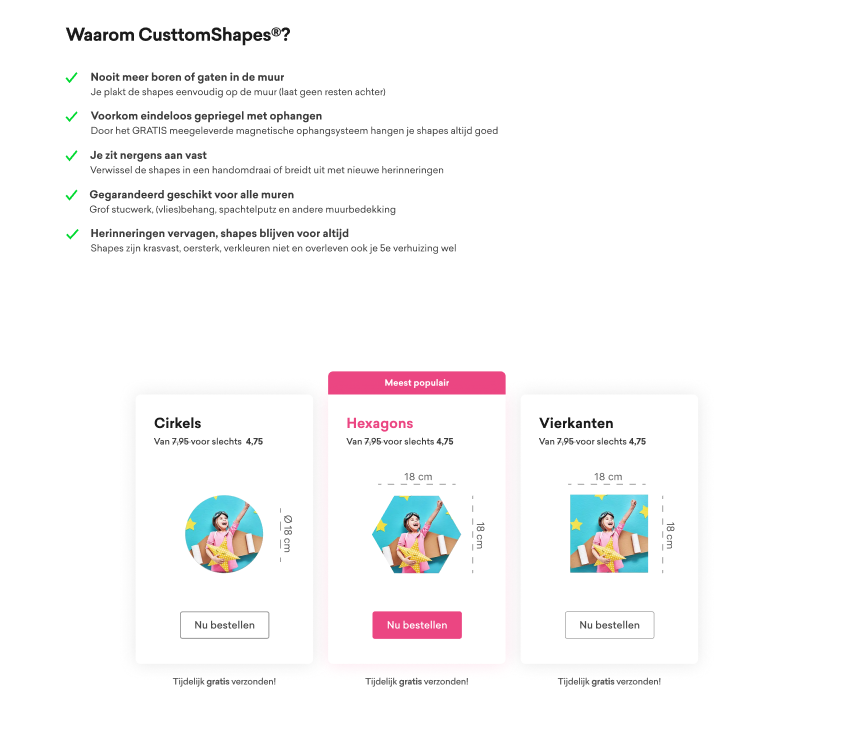
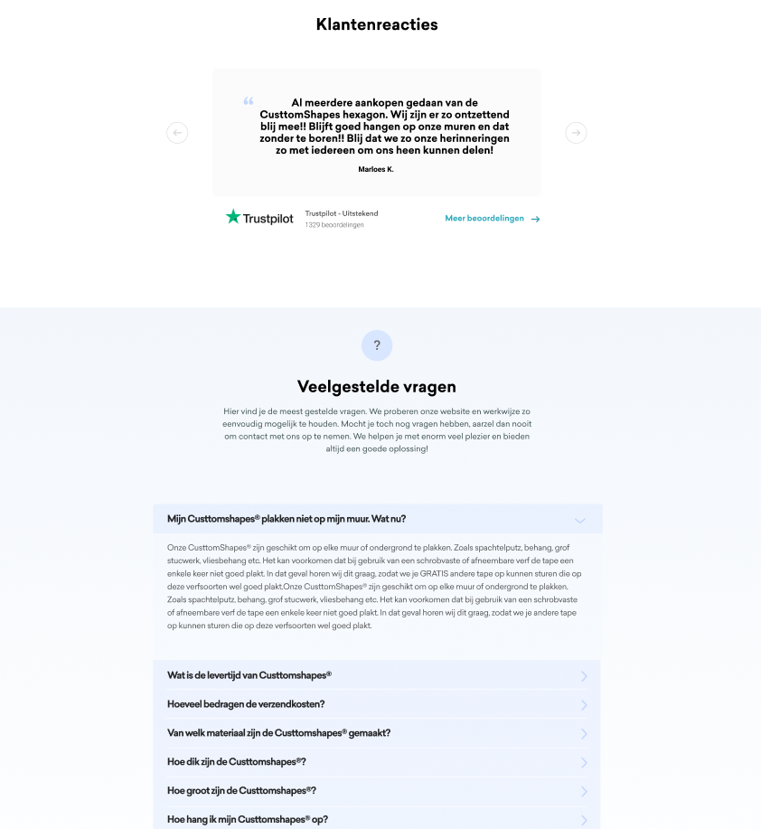
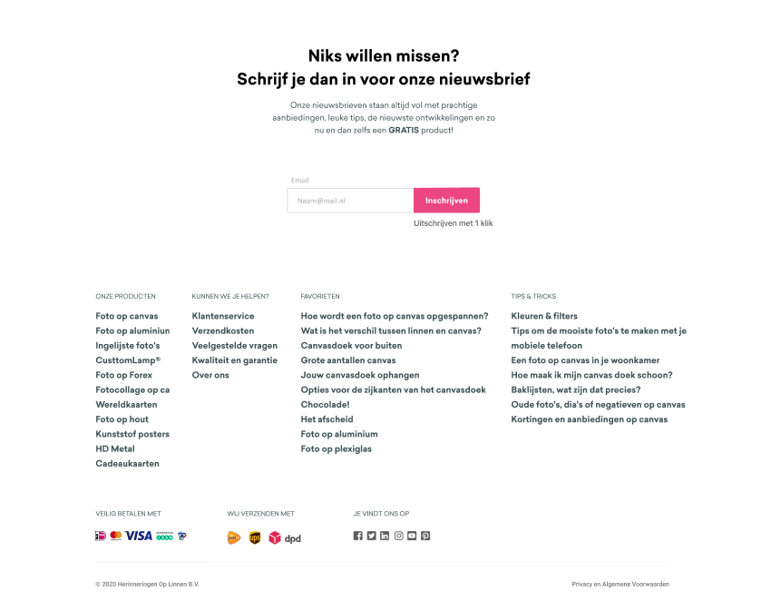
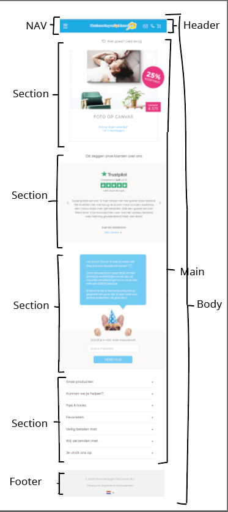
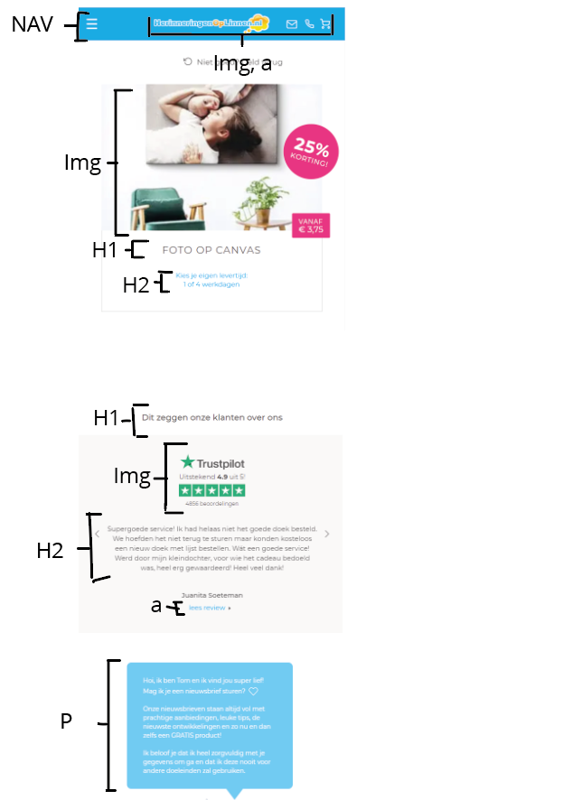
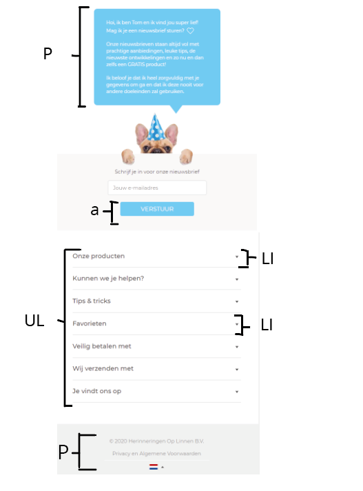

# Procesverslag
**Auteur: -Marleen Buchner |500813261 | versie 2 september 2020-

Markdown cheat cheet: [Hulp bij het schrijven van Markdown](https://github.com/adam-p/markdown-here/wiki/Markdown-Cheatsheet). Nb. de standaardstructuur en de spartaanse opmaak zijn helemaal prima. Het gaat om de inhoud van je procesverslag. Besteedt de tijd voor pracht en praal aan je website.

## Bronnenlijst
1. -https://www.herinneringenoplinnen.nl-
2. -https://developer.mozilla.org/en-US/docs/Web/HTML/Element/details -
3. -...-

## Eindgesprek (week 7/8)

-dit ging goed & dit was lastig-

**Screenshot(s):**

-screenshot(s) van je eindresultaat-

## Voortgang 3 (week 6)

### Stand van zaken

-dit ging goed & dit was lastig-

**Screenshot(s):**

-screenshot(s) van hoe ver je bent-

### Agenda voor meeting

-samen met je groepje opstellen-

### Verslag van meeting

-na afloop snel uitkomsten vastleggen-

## Voortgang 2 (week 5)

### Stand van zaken

-dit ging goed & dit was lastig-

Is er een mogelijkheid om 2n en 3n te selecteren via p:nth-of-type(3n)?
Voor indexpage heeft de eerste een achtergrond image op volle breedte + die vast zit aan de navigatie. Maar op index had ik witruimte tussen alle sections en article door margin. Ik dacht eerst dat ik het zou moeten oplossen met alles apart selecteren, maar heb het opgelost door de section in indexpage een margin te geven van 0. Het enigste wat nu moeten worden opgelost is dat de image volledig zichtbaar moet zijn en niet een deel.

Ik twijfel bij de section productenoverzicht of ik de p op de juiste manier heb gepositioneerd. Nu is de img relative en de p absolute. Of moet het article op position relative. De reden waarom ik twijfel, omdat je grote getallen em gebruik. En dat lijkt mij niet de bedoeling.

**Screenshot(s):**

-screenshot(s) van hoe ver je bent-

### Agenda voor meeting

De navigatie sloopt de position van de badges, Hoe los ik dit op?
De image op indexpage2 is niet volledig zichtbaar.
De section productenoverzicht welk element moet ik position:relative meegeven? 
Moet je flexbox gebruiken op basis van mobile-first? En ook als het dan al goed staat? 
Ik zit een beetje met wat ik nu moet flexen, productenoverzicht?

### Verslag van meeting

Badges positioneren door article postion: relative mee te geven ipv img
Let op, want elke product heeft een eigen article.
image op indexpage heeft background-size en height mee
Misschien de intro indexpage2 in de header plaatsen ipv main
Main margin ipv body margin.
productensection flexen met flex:wrap komen de producten naast elkaar 
section producten position:relative
slider images met scroll-snap
Js interactie waar click je op en kan wat leuks gebeuren(ingeschrijven nieuwsbrief)
Use overflow:hidden ipv visability:hidden / display:none anders verdwijnt het ook voor een schermlezer.

## Voortgang 1 (week 3)

### Stand van zaken
Aanpak mobile first, tips&trick, hoe pak je dit aan.
Inklapbare items hoe kan je dit het beste doen?

**Screenshot(s):**

-screenshot(s) van hoe ver je bent-

### Agenda voor meeting

Een agenda maken voor de volgelde meeting

### Verslag van meeting

Chatclub aangemaakt, zodat wij volgende een agenda kunnen opstellen voor de meeting.
Je mag maar één H1 per pagina gebruiken. Het logo kan je ook in een h1 plaatsen.
Tip voor mobile first hou het scherm klein en werk daaruit verder.
Voor inklapbare items kan je het element <details gebruiken.
Plaats de productenlijst in <article elementen. Dus <article ipv <li
Bij het formulier zorg ervoor dat het label gekoppeld is aan de input.
Dit kan je doen door Label for:    
Ga vooral verder met flexen.

## Intake (week 1)

**Je startniveau:** blauwe piste

**Je focus:** surface plane.

**Je opdracht:** Een herontwerp van de website herinneringenoplinnen. Die ik samen met een team gemaakt heb tijdens het vak Commercieel Ontwerpen.

link naar de website: https://www.herinneringenoplinnen.nl/

Waarom heb ik gekozen voor deze website?
* De website is voor mij persoonlijk hopelijk wat makkelijker te doen.
* Er staat diverse elementen op de website.
* Uitdagingen: Coderen in het algemeen, vooral Javascript. Carrousels, van mobile screen naar desktop screen, 

**Screenshot(s)eigen ontwerp:**

**Breakdown-schets(en):**

